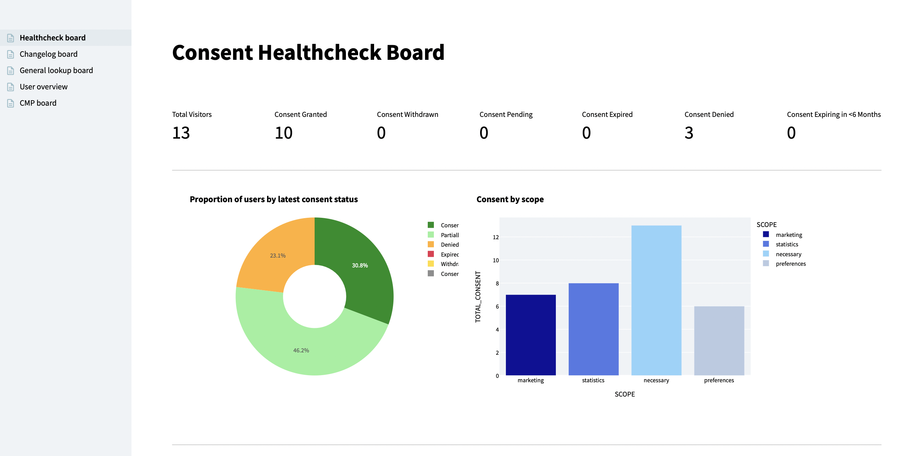

+++
title = "Snowplow Consent Tracking Accelerator"
menuTitle="Introduction"
chapter = false
weight = 1
+++

### Welcome to the Consent Tracking accelerator

This accelerator will help you collect user interactions and preferences from your Consent Management Platform (CMP) using the enhanced consent plugin from Snowplow.

User consent for data collection is vital when talking about product, personalisation, marketing and ML-driven actions. CMPs provide a limited amount of data about user preferences but with the enhanced consent plugin this can become a rich source of information to understand consent in your business.

By using Snowplow to collect consent preference data, you can enrich your data model with user level, granular and context-rich selection data. Having user consent data available in your central data store allows enriching your segments or ML models with this information and take action respectfully of a user's choices.

Here you will learn how to:

- Set-up Snowplow Consent Tracking on your CMP (_example using Cookiebot_)
- Model your data using the Snowplow-Consent model
- Create a consent health check dashboard from your data in Streamlit

#### Who is this guide for?

- Data practitioners who would like to get familiar with the Snowplow enhanced-consent-plugin.
- Data practitioners who want to learn how to use the snowplow-consent dbt package and set-up tracking using their companies website or single page application, to gain insight from their customers’ behavioural data as quickly as possible.

***

#### What you will learn

In approximately 5 working hours you can achieve the following:

- **Track -** Set-up and deploy tracking to your website or single page application to allow consent tracking
- **Model -** Enable and run the consent module within the snowplow-web data model
- **Visualise -** Visualise the modeled data with Streamlit


gantt
        dateFormat  HH-mm
        axisFormat %M
        section 1. Track
        3h          :track, 00-00, 3h
        section 2. Model
        1h          :model, after track, 1h
        section 3. Visualise
        1h          :visualise, after model, 1h



***

#### Prerequisites

{}
Complete our [Advanced Analytics for Web](https://docs.snowplow.io/accelerators/web/) accelerator if you don't have any Snowplow modelled web data in your warehouse yet. You don't need a working Snowplow pipeline, a sample events dataset is provided.
{}

**Modeling and Visualisation**
- dbt CLI installed or dbt Cloud account available
  - New dbt project created and configured
- Python 3 Installed
- Snowflake or BigQuery account

**Tracking and Enrichment**
- Snowplow pipeline
- Web app to implement tracking
- CMP Set up

{}
Please note that currently the data model supports Snowflake and BigQuery only. Further adapter support for this accelerator coming soon!
{}

