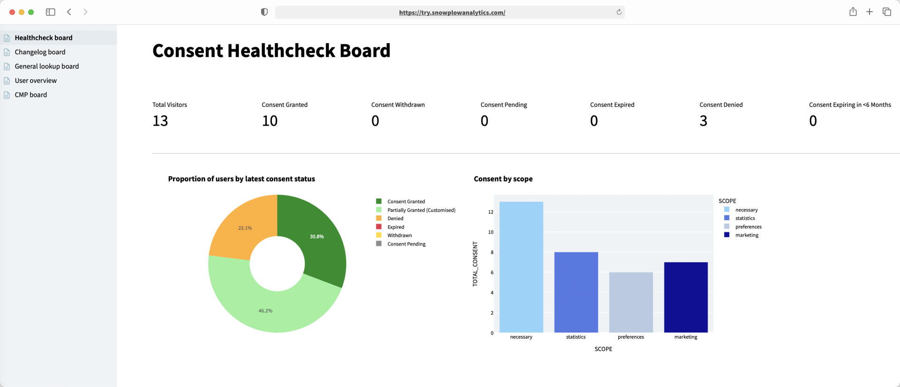

+++
title = "Snowplow Consent Tracking Accelerator"
menuTitle="Introduction"
chapter = false
weight = 1
+++

### Welcome to the Consent Tracking accelerator

This accelerator will help you collect data from user interactions with your Consent Management Platform _(CMP)_ and their preferences, using the enhanced consent plugin from Snowplow.

Data collection and user consent has become a main concern when talking about product, personalisation, marketing and ML-driven actions. At the same time, CMPs can provide a limited and siloed amount of data about user preferences and individual selection.

By using Snowplow to collect consent preference, you can enrich your data model with user level, granular and context-rich selection data. Having user consent available in your central data store allows enriching your segments or ML models with this information and take action respectfully of a user's choices.

Here you will learn to:

- Set-up Snowplow Consent Tracking on your CMP (_example using Cookiebot_)
- Model your data using the Snowplow-Consent model
- Create a consent health check dashboard from your data in Streamlit

#### Who is this guide for?

- Data practitioners who would like to get familiar with the Snowplow enhanced-consent-plugin.
- Data practitioners who want to learn how to use the snowplow-consent dbt package and set-up tracking using their companies website or single page application, to gain insight from their customers’ behavioural data as quickly as possible.

#### Prerequisites

**Modeling and Visualisation**
- dbt CLI installed or dbt Cloud account available
  - New dbt project created and configured
- Python 3 Installed
- Snowflake or BigQuery account

**Tracking and Enrichment**
- Snowplow pipeline
- Web app to implement tracking

{}
Please note that currently the data model supports Snowflake and BigQuery only. Further adapter support for this accelerator coming soon!
{}

